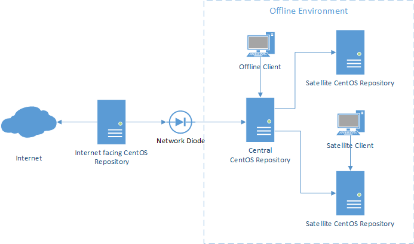

<!-- omit in toc -->
# Offline CentOS Repository

A pattern for offline CentOS repositories using Ansible

<!-- PROJECT SHIELDS -->
<!--
*** I'm using markdown "reference style" links for readability.
*** Reference links are enclosed in brackets [ ] instead of parentheses ( ).
*** See the bottom of this document for the declaration of the reference variables
*** for contributors-url, forks-url, etc. This is an optional, concise syntax you may use.
*** https://www.markdownguide.org/basic-syntax/#reference-style-links
-->
[![Contributors][contributors-shield]][contributors-url]
[![Forks][forks-shield]][forks-url]
[![Stargazers][stars-shield]][stars-url]
[![Issues][issues-shield]][issues-url]
[![MIT License][license-shield]][license-url]
[![LinkedIn][linkedin-shield]][linkedin-url]

<!-- TABLE OF CONTENTS -->
## Table of Contents <!-- omit in toc -->

- [About The Project](#about-the-project)
- [Structure](#structure)
  - [Internet facing CentOS Repository](#internet-facing-centos-repository)
  - [Central Offline CentOS Repository](#central-offline-centos-repository)
  - [Satellite Repositories](#satellite-repositories)
  - [Built With](#built-with)
- [Getting Started](#getting-started)
  - [Prerequisites](#prerequisites)
- [Roadmap](#roadmap)
- [Contributing](#contributing)
- [License](#license)

<!-- ABOUT THE PROJECT -->
## About The Project

There are many reason why an organisation may wish to have environments where there is no Internet access. These range from wanting to secure

Maintaining your environments in an offline environment comes with many issues, this is why I felt it worth creating this repository to provide a pattern for developing 



## Structure

<!-- INTERNET FACING CENTOS REPOSITORY -->
### Internet facing CentOS Repository

The Internet facing CentOS Repository will be used for downloading the repository files which can then be moved into the environment that doesn't have an Internet connection.ark

<!-- CENTRAL OFFLINE CENTOS REPOSITORY -->
### Central Offline CentOS Repository

The offline CentOS Repository is the main location where all the update files are stored for the offline environment.

<!-- SATELLITE REPOSITORIES -->
### Satellite Repositories

If you have further segregation then it may be necessary for you to provide additional satellite repositories. While this could be done in the same manner as the Internet facing CentOS Repository we are going to take a different approach for this.

### Built With

While you can implement this pattern using any approach that you like, I will be using the following technologies.

- [Ansible](https://ansible.com) - For automating the deployment
- [Nginx](https://www.nginx.com) - For the web server where the CentOS repository is presented.

<!-- GETTING STARTED -->
## Getting Started

This is an example of how you may give instructions on setting up your project locally.
To get a local copy up and running follow these simple example steps.

### Prerequisites

This is an example of how to list things you need to use the software and how to install them.
* npm
  ```sh
  npm install npm@latest -g
  ```

<!-- ROADMAP -->
## Roadmap

See the [open issues](https://github.com/othneildrew/Best-README-Template/issues) for a list of proposed features (and known issues).

<!-- CONTRIBUTING -->
## Contributing

Contributions are what make the open source community such an amazing place to be learn, inspire, and create. Any contributions you make are **greatly appreciated**. My intent by making this available is for others to be able to benefit from it but also provide their input on making this even better.

1. Fork the Project
2. Create your Feature Branch (`git checkout -b feature/AmazingFeature`)
3. Commit your Changes (`git commit -m 'Add some AmazingFeature'`)
4. Push to the Branch (`git push origin feature/AmazingFeature`)
5. Open a Pull Request

<!-- LICENSE -->
## License

Distributed under the MIT License. See `LICENSE` for more information.

<!-- CONTACT -->
<!--## Contact

Your Name - [@your_twitter](https://twitter.com/your_username) - email@example.com

Project Link: [https://github.com/your_username/repo_name](https://github.com/your_username/repo_name) -->
